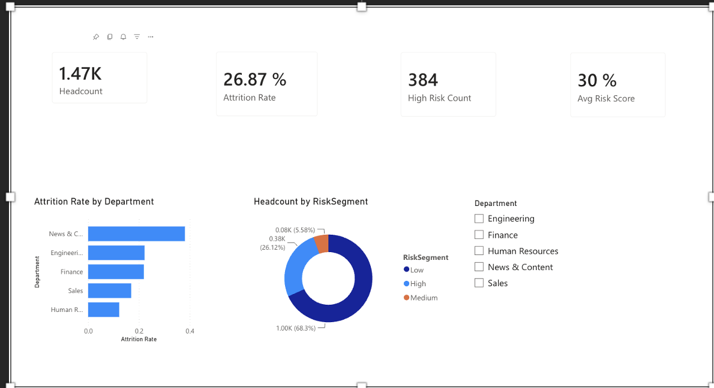
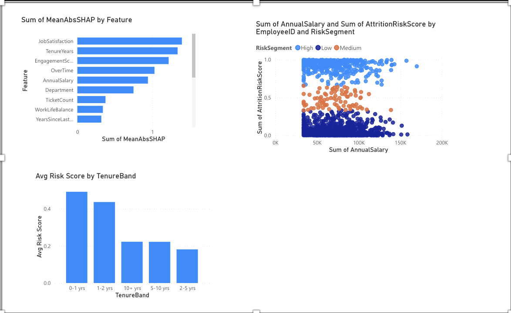
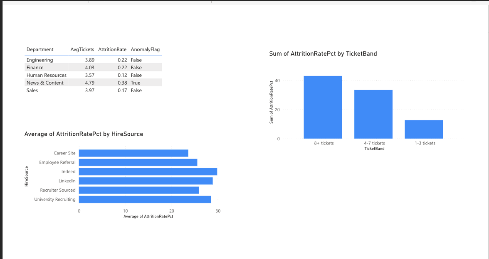

# People Analytics Platform

End-to-end HR analytics pipeline built to mirror real-world people analytics architecture at a media organization.

## Business Problem

HR data at most organizations lives in three separate systems that were never designed to talk to each other — an HRIS for employee records, an ATS for hiring, and a case management system for HR support tickets. When a leader asks why attrition is rising, someone manually exports from all three, reconciles in Excel, and emails a stale PDF. By the time the leader reads it, the data is already a week old.

This project automates that entire process — from API integration through to a live Power BI dashboard with a predictive attrition model.

---

## Architecture

```
[UKG Pro API]     [Greenhouse API]     [ServiceNow API]
 EmployeeID         CandidateID             Email
      \                  |                    /
       ---------> API INGEST (Python) <-------
                         |
              MySQL DATABASE (SQLAlchemy)
                         |
              10 SQL QUERIES (business analytics)
                         |
         PYTHON VALIDATION (fuzzy name matching)
              flag records, never drop
                         |
         ANALYTICS-READY TABLE (single source of truth)
              /                        \
   ML LAYER                        METRICS LAYER
   XGBoost + SHAP                  Defined KPIs
   Risk segments                   Governance tiers
   Dept anomaly detection          Data dictionary
              \                        /
           POWER BI (3-page dashboard)
           + EXCEL REPORT (3 sheets)
```

---

## Key Results

| Metric | Value |
|--------|-------|
| Employees | 1,470 across 5 departments |
| Source systems | 3 (different key types each) |
| Validation pass rate | 99.5% (7 records flagged, none dropped) |
| SQL queries | 10 people analytics questions answered |
| Model ROC-AUC | 0.889 |
| Precision at top 15% | 81.8% |
| Top attrition driver | Job Satisfaction (above salary) |
| Company attrition rate | 26.87% |
| News and Content attrition | 38.1% — flagged as anomaly |
| 8+ ticket employees attrition | 43.15% vs 12.71% for low-ticket |

---

## Dashboard Screenshots

### Page 1 — Executive Summary


### Page 2 — Attrition Drivers


### Page 3 — Anomaly Detection


---

## Tech Stack

| Category | Tools |
|----------|-------|
| Languages | Python, SQL |
| Database | MySQL (local), Snowflake-ready |
| ML | XGBoost, SHAP, scikit-learn |
| APIs | Flask (mock REST server), requests |
| Data | pandas, SQLAlchemy, openpyxl |
| Visualization | Power BI Service |
| Automation | cron scheduler, pipeline trigger endpoint |

---

## Project Structure

```
people_analytics/
├── pipeline/
│   ├── 00_api_server.py          # Mock REST APIs (UKG, Greenhouse, ServiceNow)
│   ├── 01_generate_hris.py       # UKG Pro style source data
│   ├── 02_generate_ats.py        # Greenhouse ATS style source data
│   ├── 03_generate_cases.py      # ServiceNow case log style source data
│   ├── 04_load_to_sql.py         # Load all sources to MySQL
│   ├── 05_sql_queries.py         # 10 people analytics SQL queries
│   ├── 06b_ingest_from_api.py    # Pull data via REST API calls
│   ├── 06_integrate_validate.py  # Join 3 systems + fuzzy name validation
│   ├── 07_model_and_anomalies.py # XGBoost model + SHAP + anomaly detection
│   └── 08_generate_excel_report.py # Excel executive summary (3 sheets)
├── data/                         # Generated source CSV files
├── output/                       # Pipeline outputs (feeds Power BI)
├── screenshots/                  # Power BI dashboard screenshots
├── docs/
│   ├── metrics_dictionary.md     # Agreed definitions for all KPIs
│   ├── governance.md             # Access tiers and data quality rules
│   ├── snowflake_architecture.md # Production architecture notes
│   └── powerbi_build_guide.md   # Dashboard build steps and DAX measures
└── README.md
```

---

## Run Order

### Setup

```bash
git clone https://github.com/nitintewari39/people-analytics-platform.git
cd people-analytics-platform
uv venv
source .venv/bin/activate
uv pip install pandas numpy scikit-learn xgboost shap faker openpyxl flask requests sqlalchemy pymysql
```

### Run the pipeline

**Terminal 1 — Start the API server (leave running):**
```bash
python pipeline/00_api_server.py
```

**Terminal 2 — Run pipeline in order:**
```bash
python pipeline/01_generate_hris.py
python pipeline/02_generate_ats.py
python pipeline/03_generate_cases.py
python pipeline/04_load_to_sql.py
python pipeline/05_sql_queries.py
python pipeline/06b_ingest_from_api.py
python pipeline/06_integrate_validate.py
python pipeline/07_model_and_anomalies.py
python pipeline/08_generate_excel_report.py
```

### Outputs

After running, the `output/` folder contains:

| File | Description |
|------|-------------|
| analytics_ready.csv | Validated integrated dataset (1,470 rows, 23 columns) |
| attrition_scored.csv | Employees with risk scores and segments |
| shap_feature_importance.csv | Top attrition drivers ranked by SHAP |
| anomaly_flags.csv | Department-level anomaly detection results |
| data_quality_report.csv | Records flagged during validation |
| dept_summary_sql.csv | Department metrics from SQL layer |
| people_analytics_executive_report.xlsx | Excel report (3 sheets) |

---

## Key Design Decisions

**Why LEFT JOIN not INNER JOIN**
Internal transfers and long-tenured employees predate the ATS — they won't have a Greenhouse record. INNER JOIN would silently drop those people from headcount.

**Why fuzzy name matching**
ATS systems capture nicknames (Bob vs Robert). Exact-match joins miss those records silently. Fuzzy first-name comparison with a confidence threshold catches the drift.

**Why flag never drop**
Auto-correcting bad records introduces errors that are hard to trace downstream. Every flagged record goes into a quality report for human review.

**Why segments not raw scores**
A raw score of 0.847 implies false precision. High/Medium/Low communicates the right thing — this person needs attention — without misleading stakeholders about model certainty.

**Why star schema in Power BI**
One central fact table (attrition_scored) with surrounding dimension and summary tables. Keeps filter context clean and prevents ambiguous relationship chains.

---

## Data Governance

Three access tiers:

- **Tier 1** — Aggregated metrics visible to all leaders (headcount, turnover rates, dept-level engagement)
- **Tier 2** — Individual risk scores for HR partners only (never shown to people managers without HR review)
- **Tier 3** — Compensation detail and identity crosswalk — stays inside the pipeline, never reaches any output

Full details in `docs/governance.md`

---

## Production Architecture

This project runs locally with MySQL and CSV outputs. In production:

- Pipeline scheduled via **Azure Data Factory** or cron
- Outputs land in **Snowflake** staging tables
- **Power BI Service** connects to Snowflake with scheduled refresh at 6am
- Leaders open one URL — data always current
- Email = notification that refresh completed, not the report as an attachment

Connection string is the only code change needed (MySQL → Snowflake). All SQL is standard ANSI, identical syntax in both.

